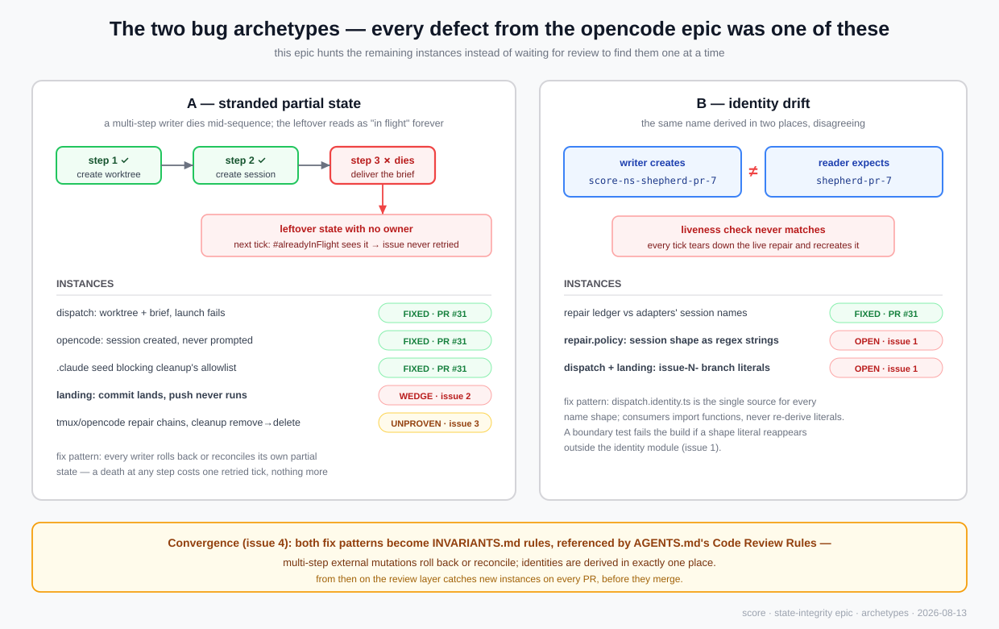
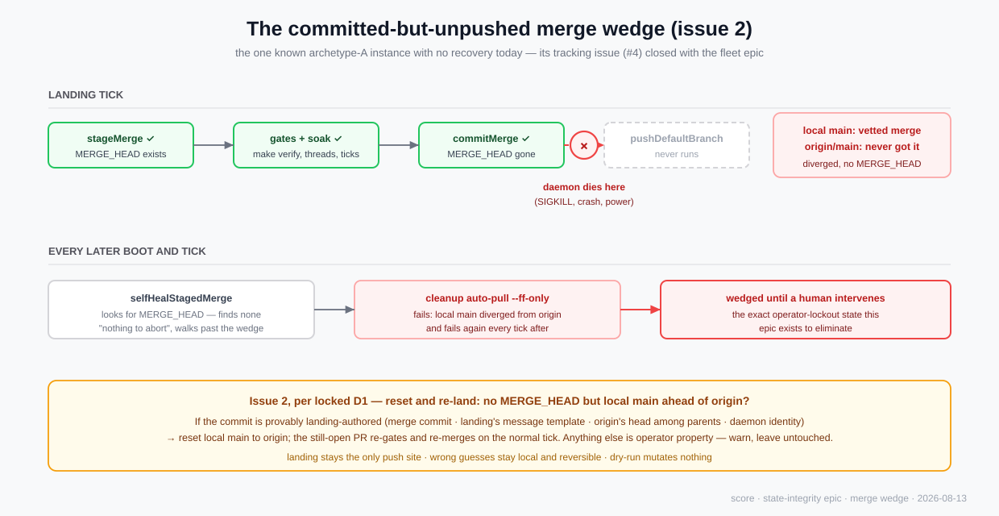

# State integrity: strand-proof mutations and single-source identities

## Outcome

A Score daemon whose every multi-step external mutation either completes,
rolls back, or reconciles on the next tick — and whose every session/branch
identity is derived in exactly one place — so that a process death at any
instant can cost at most one retried tick, never a permanently stuck issue,
a torn-down live agent, or a wedged checkout. The two rules are written into
the repo's own review authority so future PRs are checked against them
automatically.

## Visual architecture





Diagrams are hand-authored SVG (the diagrams are the source; no `.mmd`
siblings). Durable rendered copies:
[archetypes](https://github.com/egoisutolabs/score/blob/main/docs/architecture/diagrams/state-integrity/archetypes.svg)
·
[merge wedge](https://github.com/egoisutolabs/score/blob/main/docs/architecture/diagrams/state-integrity/merge-wedge.svg)
(committed via PR #39; `graduate.py` drops the inline embeds above, these
links survive in the umbrella).

## Context

Every defect found during the opencode-runtime epic (#18) was one of two
archetypes:

1. **Stranded partial state** — a multi-step writer died mid-sequence and the
   leftover read as "in flight" forever: #28 (worktree created, harness
   undispatchable), #32 (session created, never briefed), the `.claude/` seed
   blocking cleanup (PR #31 review).
2. **Identity drift** — the same name derived in two places disagreeing: the
   repair ledger recording `shepherd-pr-N` while adapters create
   `score-<ns>-shepherd-pr-N` (PR #31 review).

Each instance was found reactively by review and fixed locally. This epic
inverts that: enumerate the remaining instances of both archetypes from the
code, fix or prove-safe each one, and codify the two rules so review enforces
them from then on. Authorities: `AGENTS.md`, the merged fixes on `main`
(`2bf9e2c..` history through PR #31), and the repository evidence below. This
is new safety hardening, not legacy parity work; it must not alter the
autopilot/repair/landing authority boundaries.

## Current state

Repository evidence read from `main` after PR #31/#33/#34/#35 merged.

**Sweep A — multi-step external mutations and their next-tick behavior:**

| Writer sequence | Site | Death mid-sequence today |
| --- | --- | --- |
| createWorktree → briefing → startImplementation | `dispatch.service.ts#startIssue` | **Fixed** (PR #31): worktree rolled back |
| create session → prompt_async | `opencode.service.ts.startImplementation` | **Fixed** (PR #31): session aborted+deleted |
| abort → delete → create → prompt | `opencode.service.ts.startRepair` | Self-healing by kill-first parity, **unproven by tests** |
| write prompt file → kill-session → new-session | `tmux.service.ts.startRepair` | Self-healing, **unproven by tests** |
| stageMerge → gates/soak → commitMerge → pushDefaultBranch | `landing.service.ts:158-159` | **Unrecoverable wedge**: death between commit and push leaves local default branch diverged from origin with no `MERGE_HEAD`; `selfHealStagedMerge` (`daemon.run.ts:316`) sees nothing to abort, cleanup's `--ff-only` auto-pull fails every later tick. The code comment defers this to "issue #4" — which is now **closed**, so the known wedge is tracked nowhere. |
| removeWorktree → deleteBranch | `cleanup.service.ts:59-61` | Benign (branch reused on retry), **unproven by tests** |

**Sweep B — identity shapes derived outside the authority module:**

`packages/core/src/dispatch/dispatch.identity.ts` is the declared
"session-name authority" (`sessionNameForIssue`, `repairSessionName`,
`createWorkIdentity`), but three shapes are re-derived elsewhere as literals:

- `repair.policy.ts:9,18` — session-name shape duplicated as regex strings
  (`"^issue-%N"`, `` `^score-${namespace}-issue-%N` ``).
- `dispatch.service.ts` `#alreadyInFlight` — branch prefix `` `issue-${n}-` ``.
- `dispatch.policy.ts:58` and `landing.policy.ts:21` — branch shape as
  `/^issue-\d+-/` literals.

The PR #31 ledger bug was exactly this class; these are the remaining
instances.

**Enforcement:** `AGENTS.md` Code Review Rules say nothing about either
archetype, and the repo has no `INVARIANTS.md`. The claude-review workflow
reads the base SHA's `AGENTS.md` as its review authority, so a rule added
there is enforced on every future PR automatically.

## Hypothesis

### Change

- The committed-but-unpushed merge wedge becomes recoverable at startup, the
  same way the staged-merge wedge already is.
- Every identity shape (session names, branch prefixes) is derived from
  `dispatch.identity.ts`; the regex/string duplicates become calls into it.
- The self-healing claims for the remaining multi-step writers are pinned by
  next-tick reconciliation tests instead of being folklore.
- `INVARIANTS.md` records the two rules and the audited-writer table;
  `AGENTS.md`'s review rules reference them, making violations reviewable
  defects.

### Preserved behavior

- Autopilot, repair, and landing keep their current order, gates, pacing, and
  authority boundaries.
- Unmanaged legacy behavior is untouched, including `DEFAULT_SESSION_SUFFIX`'s
  documented legacy quirk (`repair.policy.ts:5-9`) — shapes are consolidated,
  not changed.
- No new packages, no Zod, no schema DSL; models stay interfaces.
- Dry-run continues to make zero mutating calls everywhere.

## Scope

- Startup recovery for a committed-but-unpushed default-branch merge.
- Identity derivation consolidated into `dispatch.identity.ts` with the three
  duplicate sites rewritten to consume it.
- Next-tick reconciliation tests for the writers marked "unproven" above,
  fixing anything the tests expose.
- `INVARIANTS.md` (two rules + audited-writer table) and the `AGENTS.md`
  review-rule addition.

## Out of scope

- New scheduling, repair, or landing policy beyond the recovery path.
- Crash-safety for state Score does not own (GitHub-side consistency,
  OpenCode server internals).
- Persisting the repair ledger or soak counters across restarts (documented
  as in-memory by design).
- The pi-runtime and other future harness epics.

## Architecture

No new components. Three existing owners each absorb their own archetype:

- **`dispatch.identity.ts`** (core/dispatch) becomes the single source for
  every name shape: it gains the branch-prefix and session-suffix derivations
  the three duplicate sites currently hand-roll. Consumers change from
  pattern literals to imported functions; behavior is byte-identical.
- **`daemon.run.ts` startup self-heal** extends from "abort a staged merge"
  to also "reset a committed-but-unpushed landing merge back to origin so
  the still-open PR re-lands normally" — locked as D1
  (`docs/architecture/decisions/state-integrity.md`).
- **Adapters and cleanup** own their reconciliation proofs: tests that kill
  each sequence at every step boundary and assert the next tick converges.

### Call stacks

Recovery path (proposed ownership, names not final):

```text
runDaemonLoop
└─ selfHealStagedMerge(git, log, dryRun, defaultBranch)      daemon.run.ts:316
   ├─ MERGE_HEAD present → existing abort path (unchanged)
   └─ [new] no MERGE_HEAD, local default branch ahead of origin
      ├─ commit is landing-authored (merge commit · landing's message
      │  template · origin's head among parents · daemon identity)
      │  → reset local default branch to origin (D1); the still-open PR
      │    re-gates and re-merges on the normal landing tick
      ├─ anything else → warn and leave untouched                ▸ operator-owned
      └─ dry-run → report what would happen, mutate nothing
```

Identity consolidation (no runtime flow change):

```text
repair.policy.sessionSuffixForNamespace ─┐
dispatch.service.#alreadyInFlight        ├─→ dispatch.identity.ts (single source)
dispatch.policy.isOwnedIssueWorktree     │
landing.policy (onlyIssueBranches)      ─┘
```

## Validation strategy

- **Recovery:** fixture-repo tests driving the real `GitService` through
  stage → commit → (no push) → restart, asserting the wedge clears under the
  locked policy and that a human's own unpushed commit on the default branch
  is never touched. Dry-run variant mutates nothing.
- **Identity:** unit tests asserting the derived prefixes/suffixes equal the
  exact literals they replace (guarding parity), plus a grep-style boundary
  test failing if `issue-\d` or `score-.*-issue` shape literals reappear
  outside `dispatch.identity.ts` (mirror of the existing `boundary.test.ts`
  pattern).
- **Reconciliation proofs:** per writer, a test per step boundary: fail step
  N, run the next tick, assert convergence (retried, self-healed, or benign
  leftover explicitly asserted as benign).
- **Docs:** review-rule addition verified by the review workflow reading base
  `AGENTS.md` (existing mechanism, no new tooling).

## Delivery topology

Advisory, based on `main` as read today; revalidate before starting.

### Keystone work and stable interfaces

None strictly — the three lanes own disjoint files. `INVARIANTS.md` is a
convergence artifact, not a keystone: it documents what the lanes prove.

### Recommended waves

| Wave | Issues | Why they can overlap | Convergence gate |
| --- | --- | --- | --- |
| 0 | `identity-single-source`, `unpushed-merge-recovery`, `reconciliation-proofs` | Disjoint ownership: identity module + its consumers vs landing/startup recovery vs adapter/cleanup tests | All three green on main |
| 1 | `invariants-and-review-rules` | Sole writer of INVARIANTS.md/AGENTS.md; needs the lanes' outcomes to document | Review workflow enforces the new rules |

### Critical path and useful concurrency

Critical path: `reconciliation-proofs` (3) → `invariants-and-review-rules` (1)
= **4 points**. Total complexity **9 points**. Useful concurrency: three lanes
in wave 0. Evidence: the wave-0 issues touch disjoint files except
`dispatch.service.ts`, where `identity-single-source` edits `#alreadyInFlight`
and `reconciliation-proofs` only adds tests — named handoff: the proofs issue
rebases its dispatch tests on the consolidated identity functions if it lands
second.

### Isolation assumptions

Same as the opencode epic: isolated git worktrees per issue, remote PR flow
via the managed daemon, `make verify` as the gate. If Score itself dispatches
these issues, note that `unpushed-merge-recovery` modifies the very self-heal
path the daemon runs at startup — it merges like any other PR, but the
real-repo fixture tests are the safety net, not a live-daemon experiment.

## Issues

- [ ] **[1]** [Single-source identity derivation](identity-single-source.md)
  (complexity 2): move the branch-prefix and session-suffix shapes into
  `dispatch.identity.ts`; rewrite the three duplicate sites to consume it;
  parity tests pin the exact legacy strings.
- [ ] **[2]** [Committed-but-unpushed merge recovery](unpushed-merge-recovery.md)
  (complexity 3): extend startup self-heal to detect a landing-authored merge
  commit that never pushed and recover per the locked policy; never touch
  operator commits; fixture-repo tests.
- [ ] **[3]** [Next-tick reconciliation proofs](reconciliation-proofs.md)
  (complexity 3): kill every remaining multi-step writer at each step
  boundary in tests; assert convergence; fix any strand exposed.
- [ ] **[4]** [Invariants doc and review-rule enforcement](invariants-and-review-rules.md)
  (complexity 1): write `INVARIANTS.md` (two rules + audited-writer table);
  add the rules to `AGENTS.md` Code Review Rules.
  - Depends on: `identity-single-source`, `unpushed-merge-recovery`,
    `reconciliation-proofs`.

## Open questions

1. ~~Recovery policy~~ — **locked 2026-08-13 as D1: reset and re-land**
   (see `docs/architecture/decisions/state-integrity.md`). The still-open
   PR re-gates and re-merges on the normal tick; landing remains the only
   push site; anything not provably landing-authored is left untouched.
2. ~~Boundary test~~ — resolved: write it (one test; the archetype has
   bitten four times). Not a durable-record decision.

Next action: `$write-issue`, then graduate.
